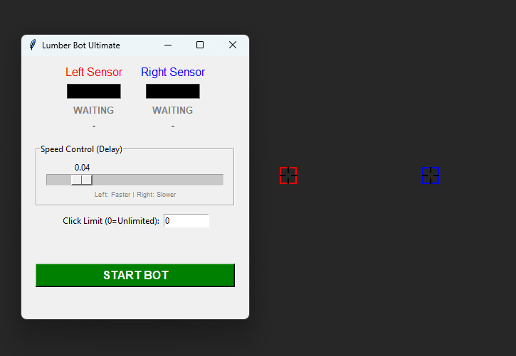

# Telegram Lumberjack Game Cheater


A Python automation bot designed to play and cheat in the Telegram **Lumberjack** game. This bot uses screen processing and color detection to automatically chop the tree while avoiding branches.

## What is it?

This tool is a desktop application with a graphical user interface (GUI) built using `tkinter`. It creates two "sensor" windows that overlay on your screen. These sensors monitor the game's visuals to detect where the branches are and automatically send keypress commands (Left/Right) to chop the tree at high speeds.



## How it Works

The bot operates on a simple but effective visual detection principle:

1. **Sensors**: Two small, transparent draggable windows (Left and Right) are placed over the game area where the branches appear.
2. **Calibration**: When you start the bot, it records the "background" color (usually the sky) at the sensor locations.
3. **Detection**: The bot continuously checks the pixel color at the sensor centers. If the color differs significantly from the calibrated background color, it assumes a branch is present.
4. **Logic**:
    * If a branch is detected on the **Left**, the bot moves/stays **Right**.
    * If a branch is detected on the **Right**, the bot moves/stays **Left**.
    * The bot simulates keyboard presses (`Left` or `Right` arrow keys) to control the character.
5. **Speed Control**: A slider allows you to adjust the delay between actions, effectively controlling the chopping speed.
6. **Click Limit**: An input field allows you to set a maximum number of clicks (chops). The bot will automatically stop after reaching this limit. Set to 0 for unlimited.

## Prerequisites

To run this bot, you need to have **Python** installed on your computer.

* **OS**: Windows (optimized for Windows scaling)
* **Python Version**: 3.x recommended

## Installation Guide

### Step 1: Install Python

If you don't have Python installed:

1. Go to the [official Python website](https://www.python.org/downloads/).
2. Download the latest version for Windows.
3. Run the installer and **make sure to check the box "Add Python to PATH"** before clicking Install.

### Step 2: Install Dependencies

The bot uses `pyautogui` for screen reading and keyboard control. You need to install it via the command line.

1. Open your Command Prompt (cmd) or PowerShell.
2. Run the following command:

    ```bash
    pip install pyautogui
    pip install Pillow
    ```

    *(Note: `Pillow` is required for `pyautogui` to read screen pixels. `tkinter` is included with standard Python installations.)*

## How to Run

1. Navigate to the folder containing `bot.py` in your terminal.
2. Run the script:

    ```bash
    python bot.py
    ```

## Usage Instructions

1. **Launch the Game**: Open Telegram and start the Lumberjack game.
2. **Position the Sensors**:
    * You will see two small squares titled **L** (Red border) and **R** (Blue border).
    * Drag the **L** sensor to the left side of the tree, exactly where a branch would appear.
    * Drag the **R** sensor to the right side of the tree, mirroring the left one.
    * **Tip**: Place them slightly above the character's head level so the bot has time to react.
3. **Calibrate & Start**:
    * Ensure the sensors are pointing at the empty background sky (NOT on a branch) when you start.
    * Click the **START BOT** button on the main control window.
    * The bot will capture the current background color as a reference.
4. **Play**:
    * The bot will immediately start sending keypresses.
    * You can adjust the **Speed Control** slider to make it faster or slower. If it's too fast, it might misclick or lag; if too slow, you won't get a high score.
    * Use the **Click Limit** input field to set a specific number of chops if you want the bot to stop automatically (e.g., for a specific score).
5. **Stop**: Click the **STOP** button (or close the window) to stop the bot.

## Troubleshooting

* **Wrong Detection**: If the bot is clicking blindly, ensure the sensors are NOT covering a branch when you click "START". It needs to see the empty sky color first to know what "no branch" looks like.
* **Screen Scaling**: The script includes a fix for Windows High DPI scaling, but if coordinates seem off, ensure your display scale settings are standard or try running the script as Administrator.
